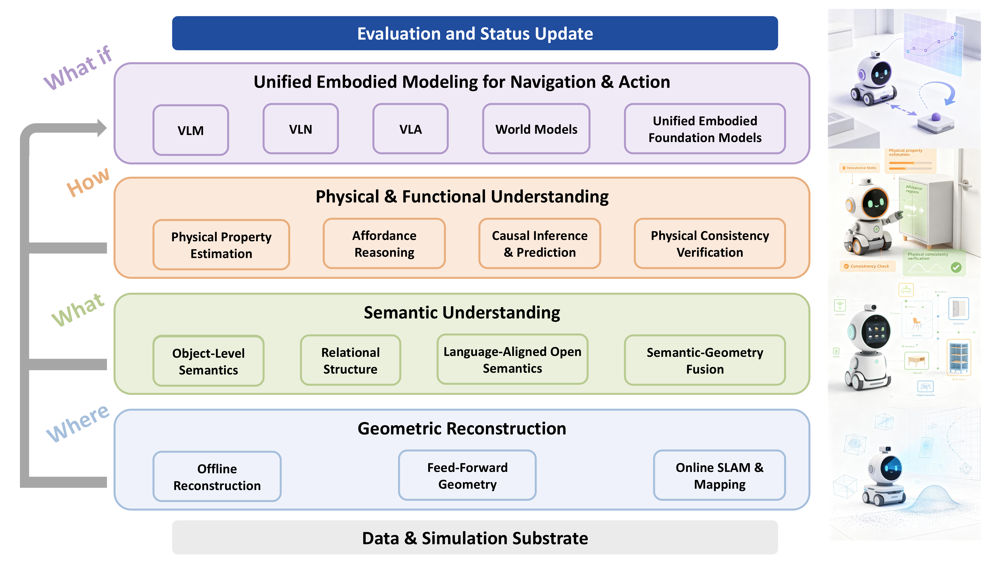

# 🤖 Actionable Scene Understanding for Indoor Embodied Manipulation: A Survey

<div align="center">

[**Yaze Li**](https://saltgardenia.github.io/) <sup>1,†</sup> · [**Xinyu Xie**](mailto:2024218501@mail.hfut.edu.cn) <sup>1,†</sup> · [**Jiawei Ma**](mailto:jiawei@hfut.edu.cn) <sup>1,†</sup> · [**Siying Song**](mailto:2024218492@mail.hfut.edu.cn) <sup>1,†</sup> · **Jianan Zou** <sup>2</sup> · [**Haihong Xiao**](mailto:haihong@mail.hfut.edu.cn) <sup>1,∗</sup> · [**Wei Jia**](mailto:weijia@mail.hfut.edu.cn) <sup>1</sup>

<sup>1</sup> *School of Computer Science and Information Engineering, Hefei University of Technology, Hefei, China*
<sup>2</sup> *School of Automation Science and Engineering, South China University of Technology, Guangzhou, China*

<sup>†</sup> Equal contribution · <sup>∗</sup> Corresponding author

[](https://github.com/SaltGardenia/Actionable-Scene-Understanding/raw/main/public/main.pdf)&nbsp;
[](https://arxiv.org/abs/0000.00000)&nbsp;
[](https://github.com/SaltGardenia/Actionable-Scene-Understanding)&nbsp;
[](https://saltgardenia.github.io/Actionable-Scene-Understanding/)&nbsp;

🎉 Welcome to the official project page repository of our survey paper.

</div>

---

## 📌 Abstract

Scene understanding for embodied manipulation must extend beyond describing what exists in an environment to representing what can be acted upon, under which physical constraints, and with what consequences. Existing surveys have largely examined geometric reconstruction, semantic understanding, functional reasoning, or embodied intelligence as separate research directions, leaving their roles in task-oriented behavior insufficiently characterized. This survey presents a unified perspective on *actionable scene understanding* for embodied manipulation, where scene knowledge is organized according to its utility for task-conditioned perception, physical reasoning, prediction, and action. We distinguish conventional scene understanding, which primarily recovers geometric and semantic structure, from actionable scene understanding, which additionally incorporates functional affordances, physical properties and constraints, causal relations, and state evolution. From this perspective, we review datasets and evaluation protocols, geometric reconstruction, semantic understanding, physical and functional understanding, and embodied scene modeling, while examining the gap between perceptual fidelity and executable behavior. We further identify emerging directions toward latent physical-state inference, interaction-driven scene updating, persistent predictive scene modeling, and human-aware embodied understanding. By connecting scene representation with action-conditioned prediction and closed-loop behavior, this survey aims to provide a systematic view of how 3D scene understanding can evolve from descriptive reconstruction toward executable scene knowledge.

**Keywords:** *Spatial Intelligence, World Models, Embodied Manipulation, 3D Scene Understanding, Affordance Reasoning*

<p align="center">
  
</p>

<p align="center">
  <b>Figure 1.</b> A comprehensive view of actionable scene understanding for embodied manipulation.
</p>

---

## ✨ Introduction

Scene understanding provides the perceptual basis for embodied agents to navigate and act in physical environments. For manipulation, however, recovering spatial structure and recognizing object categories are only necessary conditions for reliable behavior. An agent must also identify task-relevant entities and regions, determine which actions are physically feasible, anticipate how the scene may change under those actions, and update its understanding as new evidence becomes available. Scene understanding for embodied manipulation is therefore not only a problem of describing the current environment, but also of maintaining a representation that supports task-conditioned decision making and physically grounded action.

We use *actionable scene understanding* to denote scene knowledge that is sufficiently grounded in the task, spatial configuration, and physical state of an environment to support feasible action selection and execution. Unlike conventional scene understanding, which primarily characterizes geometric structure and semantic content, actionable scene understanding additionally considers functional affordances, physical properties and constraints, causal relations, and state evolution that are relevant to embodied behavior. We summarize this distinction as

> `O → {G, S}`  — *Conventional Scene Understanding*
>
> `O_t → S_t = {G_t, S_t, F_t, P_t, R_t, E_t, U_t} → A_t`  — *Actionable Scene Understanding*

where `t` denotes the current time step, `O_t` denotes the observation, `G_t` denotes geometric structure, `S_t` semantic information, `F_t` functional and affordance information, `P_t` physical properties and constraints, `R_t` causal and relational dependencies relevant to action, `E_t` state evolution, and `A_t` a task-oriented action.

The key distinction is therefore not the amount of information contained in a scene representation, but its utility for task-conditioned behavior. Given a task context `T_t`, an embodied agent selects an action according to `A_t = π(S_t, T_t)`, while the executed action may induce a subsequent scene state `S_{t+1} = f(S_t, A_t)`, where `f` denotes the physical and environmental transition, and `π` denotes the policy function. Under this formulation, actionability refers to whether the maintained scene state contains the spatial, semantic, functional, physical, and predictive information required to assess action feasibility and anticipate relevant consequences. *Thus, actionability should not be interpreted as richer scene description alone: a representation is actionable only to the extent that its information remains useful under a specific task, physical constraint, and action space.*

These knowledge dimensions should not be interpreted as a strictly sequential processing pipeline. The hierarchy adopted in this survey is primarily an organizational abstraction that reflects the increasing functional requirements placed on scene knowledge, whereas an embodied system operates through coupled and recurrent dependencies. Geometry provides spatial grounding for semantic interpretation; semantics determines which entities and regions are relevant to a task; physical and functional knowledge constrains feasible actions; and predicted consequences influence subsequent decisions. Conversely, actions can generate new visual, tactile, or proprioceptive evidence that updates geometry, semantic state, physical estimates, and affordances. *Actionable scene understanding is therefore better viewed as a set of interdependent capabilities embedded within a closed perception–reasoning–action loop, rather than as a strictly hierarchical processing pipeline.*

From this perspective, this survey unifies the transition from perceptual scene reconstruction to actionable scene understanding that is task-relevant, physically grounded, and predictive for embodied manipulation, and highlights both the complementary roles of different knowledge dimensions and the persistent gaps in bridging them. We further identify four emerging directions toward more capable scene representations: inferring invisible states from visual observations, acquiring physical knowledge through self-supervision, modeling latent human states, and shifting from task completion to human-centered assistance. Collectively, these directions point toward scene understanding that is geometrically and semantically grounded, physically consistent, context-aware, and adaptive to complex real-world environments.

Concretely, this survey reviews datasets, simulation environments, and evaluation metrics; surveys geometric reconstruction methods, covering offline optimization, feed-forward prediction, and online mapping; reviews semantic understanding, from object-level perception and relational modeling to language-grounded semantics and geometry–semantic unified representations; focuses on physical and functional understanding relevant to embodied manipulation; and discusses executable embodied manipulation, spanning multimodal scene reasoning, spatial and task-level decision making, action generation and control, and predictive modeling, as well as their integration into unified embodied models.

---

## 🔖 Citation

If you find this survey useful, please consider citing:

```bibtex
@article{li2026actionable,
  title={Actionable Scene Understanding for Indoor Embodied Manipulation: A Survey},
  author={Li, Yaze and Xie, Xinyu and Ma, Jiawei and Song, Siying and Zou, Jianan and Xiao, Haihong and Jia, Wei},
  journal={arXiv preprint},
  year={2026}
}
```
